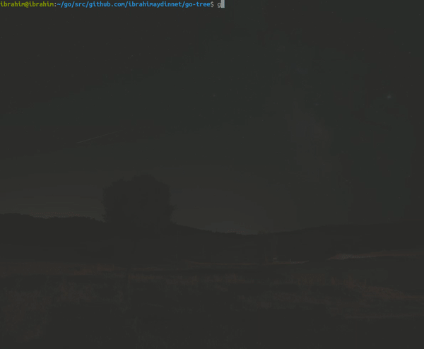

# go-tree
go-tree is a tool which draws a tree of directory structure

## Install
```bash
go get github.com/ibrahimaydinnet/go-tree
cd <YOUR_GOPATH>/src/github.com/ibrahimaydinnet/go-tree
go install -mod=vendor
cp <YOUR_GOPATH>/bin/go-tree <YOUR_GOROOT>/bin/
```

## Usage
```bash
go-tree [flags]
```


## Flags

```bash
-a, --all             Flag to list files starts with "."
-c, --color           Flag to colorize output
-d, --date            Flag to show modified times
-e, --emoji           Flag to show file and dir emojis (not supported on windows)
-f, --find string     Substring of file names to find
-h, --help            help for go-tree
-j, --justdir         Flag to list just directories
-l, --level int       Max level of tree depth
-m, --mode            Flag to show permission modes
-n, --number          Flag to show total numbers of files and directories
-o, --output string   File path to write output
-p, --path            Flag to show fullpaths
-r, --root string     Root path of the tree (default "./")
-s, --size            Flag to show formatted sizes
-t, --trim            Flag to trim empty directories
-v, --verbose         Flag to show not formatted sizes
-w, --win             Flag to list hidden files for windows
```

## Credits
- [cobra](https://github.com/spf13/cobra)
- [go-colorable](https://github.com/mattn/go-colorable)

## License

[MIT](https://choosealicense.com/licenses/mit/)